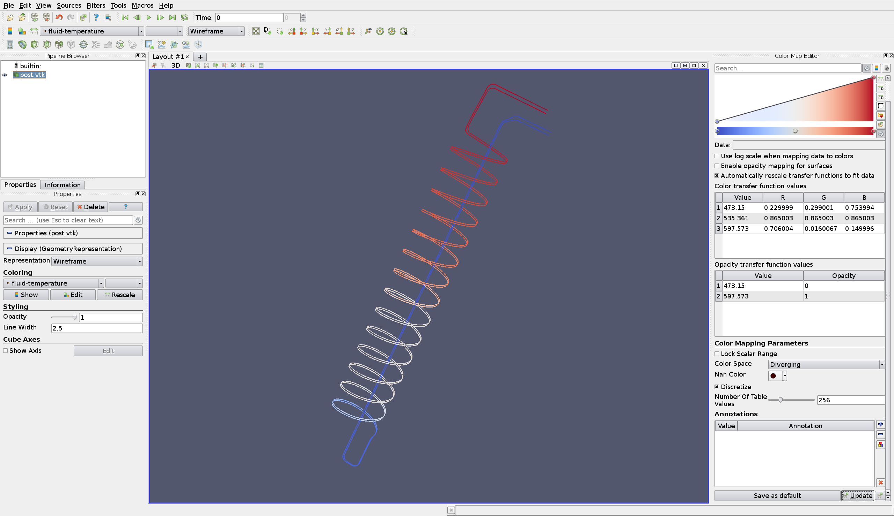
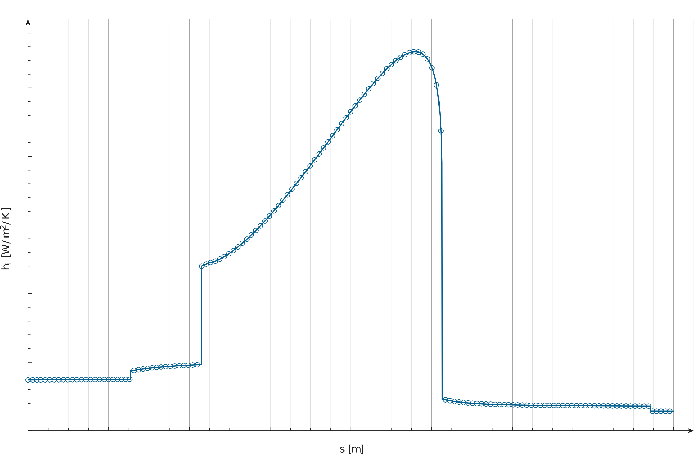

# Termo

Termo is a computational tool designed to model steady-state and, eventually, transients of thermo-hydraulic systems that involve steam and water mixtures or two-phase flow. It has been implemented as a [wasora](https://seamplex.com/wasora/) plugin, which means that it inherits all its features.

Many approaches can be applied to describe two-phase flow. Termo considers two different mixture models, namely:

  1. The homogeneous equilibrium mixture model (*HEM*). Here, the two phases move with the same velocity and also exist at the same temperature (i.e., they are at the saturation temperature for the prevailing pressure). The mixture can then be treated as a single fluid. In other words, this model suppose both thermodynamic and mechanic equilibrium.

  2. A thermal equilibrium mixture model (*SEP*) which considers an algebraic relation between the velocities (or a slip ratio) of the two phases. In this case, the model only assumes a thermodynamic equilibrium.

## Installation

Its installation procedure resembles any other wasora plugin, such as [fino](https://seamplex.com/fino/) or [milonga](https://seamplex.com/milonga/).

## Examples

The following example shows the definition of a complex geometry formed by two pipes with straight, circular and helical sections exchanging heat with the surroundings such that the liquid water in the inlet becames vapour at the outlet, i.e. there is two phase flow inside the tubes. All dimensions have been removed for confidentiality reasons.

```python
# geometry parameters:
#   number of steam generators (sg)
n_sg = 0
#   number of pipes in each sg
n_pipes = 0
#   number of pipes in current simulation
n_actual_pipes = 0
#   pipe internal diameter [m]
D = 0.000e+00
#   pipe wall thickness [m]
e = 0.000e+00
#   mean radii of curvature of bend/elbow [m]
VECTOR Ro SIZE 2 DATA 0.000e+00 0.000e+00
#   helix radius [m]
Rh = 0.000e+00
#   helix pitch [m]
Ph = 0.000e+00

# wall properties:
#   roughness
epsilon = 0.0
#   thermal conductivity k = k(T) [W/m/K]
FUNCTION k_wall(T) INTERPOLATION linear DATA {
 0.000e+00 0.000e+00
 0.000e+00 0.000e+00
}

# fluid properties:
#   inlet temperature [K]
T_inlet = 0.000e+00
#   inlet pressure [Pa]
p_inlet = 0.000e+00
#   mass flows [kg/s]
secondary_mass_flow = 0.000e+00
sg_mass_flow = secondary_mass_flow / n_sg
pipe_mass_flow = sg_mass_flow / n_pipes

# geometry definition:
#   sections and pipes definitions
INCLUDE geometry/layer_1/spiral_1.mat
INCLUDE geometry/layer_1/spiral_2.mat

#   pipe array definition
#    one pipe array simulates pipes in parallel sharing inlet fluid properties
#    and outlet pressure. in the other hand, the total mass flow is distributed
#    accordingly.
PIPE_ARRAY pipe_array DATA layer_1_spiral_1_pipe layer_1_spiral_2_pipe

#   system definitions
#    one system represents a list or union of pipes and/or pipes arrays.
SYSTEM steam_generator DATA pipe_array

# boundary conditions:
BC SYSTEM steam_generator {
  TYPE pT PRESS p_inlet TEMP T_inlet M_DOT n_actual_pipes*pipe_mass_flow
}

# problem definition:
TERMO_PROBLEM FLOW_MODEL sep SYSTEM steam_generator

# solve the problem:
TERMO_STEP

# post solutions:
PRINT_FUNCTION {
 FILE_PATH layer_1_spiral_1_results.dat
 pi_layer_1_spiral_1_pipe
 Ti_layer_1_spiral_1_pipe
 Tw_layer_1_spiral_1_pipe
 To_layer_1_spiral_1
 hi_layer_1_spiral_1_pipe
}

PRINT_FUNCTION {
 FILE_PATH layer_1_spiral_2_results.dat
 pi_layer_1_spiral_2_pipe
 Ti_layer_1_spiral_2_pipe
 Tw_layer_1_spiral_2_pipe
 To_layer_1_spiral_2
 hi_layer_1_spiral_2_pipe
}
```

Results can be visualized in [ParaView](https://www.paraview.org/) as well as be plotted as 1 dimensional curves:



